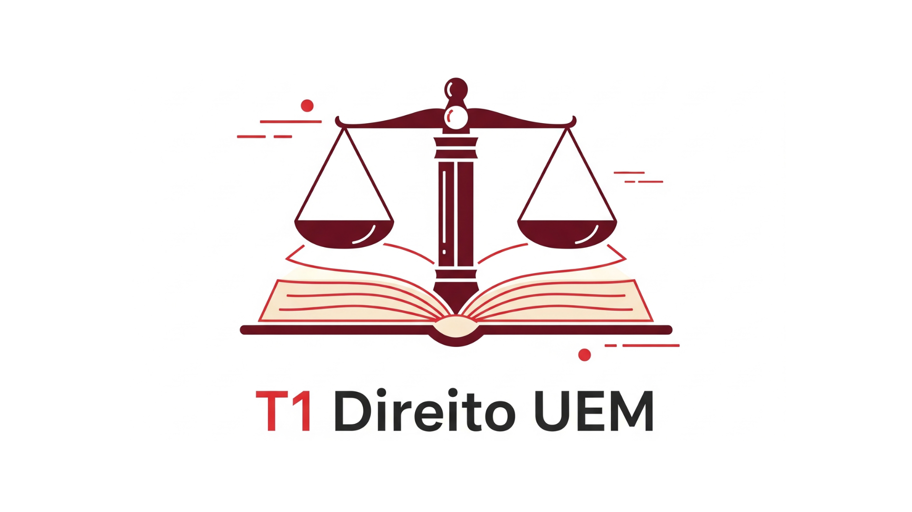

<a id="readme-top"></a>

<br />
<div align="center">
  <a href="https://github.com/othneildrew/Best-README-Template">
    
  </a>

  <h3 align="center">Portal da Turma T1 - Direito UEM</h3>

  <p align="center">
    Um portal centralizado para comunicação, organização de prazos e compartilhamento de materiais para a turma de Direito.
    <br />
    <a href="https://turmadireitouem.vercel.app"><strong>Acessar o Site »</strong></a>
    <br />
    <br />
    <a href="https://github.com/HenriqueR3is/uem-acess">Reportar um Bug</a>
  </p>
</div>

<details>
  <summary>Índice</summary>
  <ol>
    <li>
      <a href="#sobre-o-projeto">Sobre o Projeto</a>
      <ul>
        <li><a href="#construído-com">Construído Com</a></li>
      </ul>
    </li>
    <li><a href="#começando">Começando</a></li>
    <li><a href="#funcionalidades">Funcionalidades</a></li>
    <li><a href="#contato">Contato</a></li>
  </ol>
</details>

## Sobre o Projeto

Este projeto foi criado para resolver a necessidade de um canal de comunicação centralizado e de fácil atualização para a turma T1 do curso de Direito da UEM. O site anterior, construído com ferramentas limitadas, era difícil de manter atualizado.

Esta nova versão, codificada do zero, oferece um sistema de gerenciamento de conteúdo completo, permitindo que um administrador atualize todas as seções do site diretamente pelo navegador, de forma rápida e intuitiva.

O objetivo principal é fornecer aos alunos um local único e confiável para consultar:
* Prazos de provas e trabalhos.
* Avisos gerais da turma.
* Materiais de estudo, como slides e PDFs.

<p align="right">(<a href="#readme-top">voltar ao topo</a>)</p>

### Construído Com

As principais tecnologias e serviços que deram vida a este projeto:

* [](https://developer.mozilla.org/pt-BR/docs/Web/HTML)
* [](https://developer.mozilla.org/pt-BR/docs/Web/CSS)
* [](https://developer.mozilla.org/pt-BR/docs/Web/JavaScript)
* [](https://getbootstrap.com)
* [](https://firebase.google.com/)
* [](https://vercel.com/)


<p align="right">(<a href="#readme-top">voltar ao topo</a>)</p>

## Começando

Para rodar uma cópia deste projeto localmente, siga estes passos.

1.  **Clone o repositório**
    ```sh
    git clone https://github.com/HenriqueR3is/uem-acess
    ```
2.  **Configure o Firebase**
    * Crie um arquivo chamado `firebase-config.js` na raiz do projeto.
    * Vá até as configurações do seu projeto no Firebase, copie o objeto de configuração do seu app web e cole-o no arquivo, seguindo o modelo abaixo:
    ```js
    const firebaseConfig = {
      apiKey: "SUA_API_KEY",
      authDomain: "SEU_AUTH_DOMAIN",
      projectId: "SEU_PROJECT_ID",
      storageBucket: "SEU_STORAGE_BUCKET",
      messagingSenderId: "SEU_MESSAGING_SENDER_ID",
      appId: "SEU_APP_ID"
    };
    firebase.initializeApp(firebaseConfig);
    ```
3.  **Abra com o Live Server**
    * Com a extensão "Live Server" no VS Code, clique com o botão direito no arquivo `index.html` e selecione "Open with Live Server".

<p align="right">(<a href="#readme-top">voltar ao topo</a>)</p>

## Funcionalidades

* **Visualização Pública:** Qualquer pessoa pode acessar o site para ver os avisos, prazos de provas e baixar materiais de estudo.
* **Painel de Admin:** Um administrador pode fazer login através do botão "Acesso Admin".
* **Gerenciamento Completo (CRUD):** Após o login, o admin pode:
    * Adicionar, editar e excluir Avisos.
    * Adicionar, editar e excluir Provas e Trabalhos.
    * Fazer upload e excluir Materiais de Estudo.
* **Design Responsivo:** O layout se adapta perfeitamente a dispositivos móveis e desktops.

<p align="right">(<a href="#readme-top">voltar ao topo</a>)</p>

## Contato

[Henrique Hiroshi K. Reis] - [henriquehkreis@gmail.com]

Link do Projeto: [https://github.com/HenriqueR3is/uem-acess](https://github.com/HenriqueR3is/uem-acess)

<p align="right">(<a href="#readme-top">voltar ao topo</a>)</p>